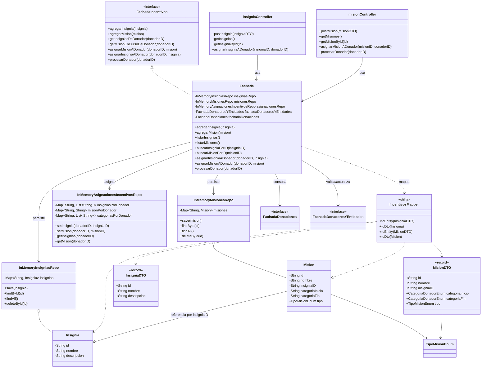

```mermaid
classDiagram

class FachadaIncentivos {
  <<interface>>
  +agregarInsignia(insignia)
  +agregarMision(mision)
  +getInsigniasDeDonador(donadorID)
  +getMisionEnCursoDeDonador(donadorID)
  +asignarMisionADonador(donadorID, mision)
  +asignarInsigniaADonador(donadorID, insignia)
  +procesarDonador(donadorID)
}

class Fachada {
  -InMemoryInsigniasRepo insigniasRepo
  -InMemoryMisionesRepo misionesRepo
  -InMemoryAsignacionesIncentivosRepo asignacionesRepo
  -FachadaDonadoresYEntidades fachadaDonadoresYEntidades
  -FachadaDonaciones fachadaDonaciones
  +agregarInsignia(insignia)
  +agregarMision(mision)
  +listarInsignias()
  +listarMisiones()
  +buscarInsigniaPorID(insigniaID)
  +buscarMisionPorID(misionID)
  +asignarInsigniaADonador(donadorID, insignia)
  +asignarMisionADonador(donadorID, mision)
  +procesarDonador(donadorID)
}

class insigniaController {
  +postInsignia(insigniaDTO)
  +getInsignias()
  +getInsigniaById(id)
  +asignarInsigniaADonador(insigniaID, donadorID)
}

class misionController {
  +postMision(misionDTO)
  +getMisiones()
  +getMisionById(id)
  +asignarMisionADonador(misionID, donadorID)
  +procesarDonador(donadorID)
}

class InMemoryInsigniasRepo {
  -Map~String, Insignia~ insignias
  +save(insignia)
  +findById(id)
  +findAll()
  +deleteById(id)
}

class InMemoryMisionesRepo {
  -Map~String, Mision~ misiones
  +save(mision)
  +findById(id)
  +findAll()
  +deleteById(id)
}

class InMemoryAsignacionesIncentivosRepo {
  -Map~String, List~String~~ insigniasPorDonador
  -Map~String, String~ misionPorDonador
  -Map~String, List~String~~ categoriasPorDonador
  +setInsignia(donadorID, insigniaID)
  +setMision(donadorID, misionID)
  +getInsignias(donadorID)
  +getMision(donadorID)
}

class IncentivosMapper {
  <<utility>>
  +toEntity(InsigniaDTO)
  +toDto(Insignia)
  +toEntity(MisionDTO)
  +toDto(Mision)
}

class Insignia {
  -String id
  -String nombre
  -String descripcion
}

class Mision {
  -String id
  -String nombre
  -String insigniaID
  -String categoriaInicio
  -String categoriaFin
  -TipoMisionEnum tipo
}

class InsigniaDTO {
  <<record>>
  +String id
  +String nombre
  +String descripcion
}

class MisionDTO {
  <<record>>
  +String id
  +String nombre
  +String insigniaID
  +CategoriaDonadorEnum categoriaInicio
  +CategoriaDonadorEnum categoriaFin
  +TipoMisionEnum tipo
}

class FachadaDonaciones {
  <<interface>>
}

class FachadaDonadoresYEntidades {
  <<interface>>
}

FachadaIncentivos <|.. Fachada
insigniaController --> Fachada : usa
misionController --> Fachada : usa
Fachada --> InMemoryInsigniasRepo : persiste
Fachada --> InMemoryMisionesRepo : persiste
Fachada --> InMemoryAsignacionesIncentivosRepo : asigna
Fachada --> FachadaDonaciones : consulta
Fachada --> FachadaDonadoresYEntidades : valida/actualiza
Fachada ..> IncentivosMapper : mapea
InMemoryInsigniasRepo o-- Insignia
InMemoryMisionesRepo o-- Mision
IncentivosMapper ..> Insignia
IncentivosMapper ..> Mision
IncentivosMapper ..> InsigniaDTO
IncentivosMapper ..> MisionDTO
Mision --> TipoMisionEnum
Mision --> Insignia : referencia por insigniaID
MisionDTO --> TipoMisionEnum
```
