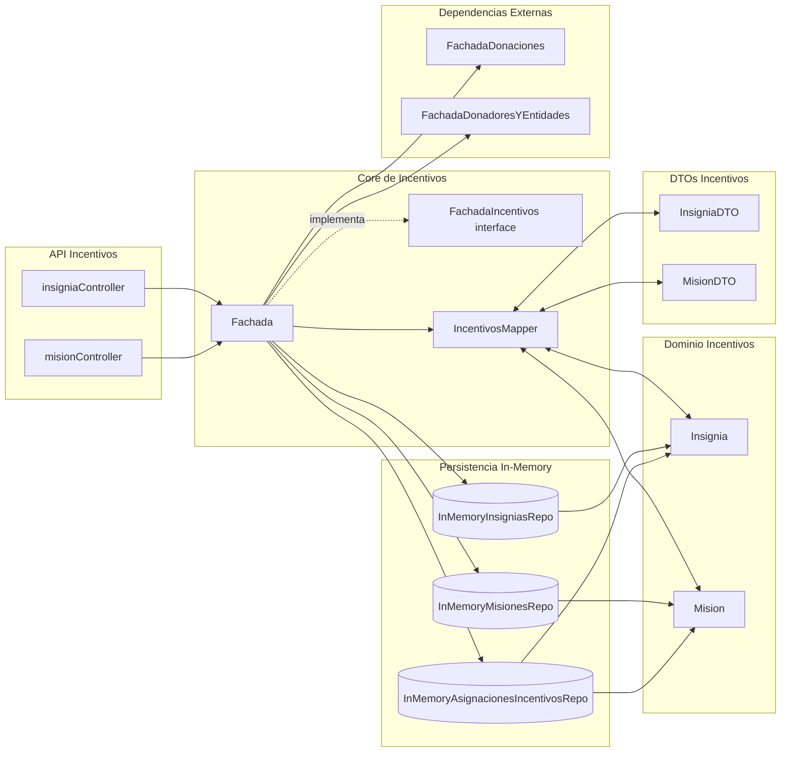

```mermaid
flowchart LR

  subgraph API[API Incentivos]
    IC[insigniaController]
    MC[misionController]
  end

  subgraph CORE[Core de Incentivos]
    FI["FachadaIncentivos interface"]
    F[Fachada]
    MAP[IncentivosMapper]
  end

  subgraph DATA[Persistencia In-Memory]
    IR[(InMemoryInsigniasRepo)]
    MR[(InMemoryMisionesRepo)]
    AR[(InMemoryAsignacionesIncentivosRepo)]
  end

  subgraph DOM[Dominio Incentivos]
    I[Insignia]
    M[Mision]
  end

  subgraph DTO[DTOs Incentivos]
    IDTO[InsigniaDTO]
    MDTO[MisionDTO]
  end

  subgraph EXT[Dependencias Externas]
    FD[FachadaDonaciones]
    FDE[FachadaDonadoresYEntidades]
  end

  IC --> F
  MC --> F
  F -.->|implementa| FI

  F --> MAP
  MAP <--> IDTO
  MAP <--> MDTO
  MAP <--> I
  MAP <--> M

  F --> IR
  F --> MR
  F --> AR

  IR --> I
  MR --> M
  AR --> M
  AR --> I

  F --> FD
  F --> FDE
```
