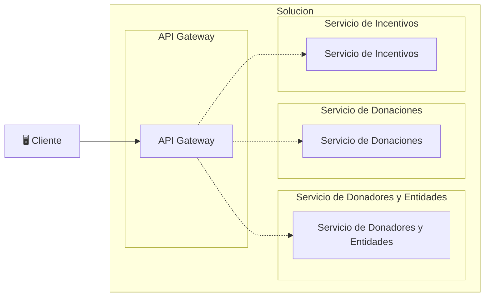

```mermaid
graph LR

Cliente["🖥️ Cliente"]

subgraph solucion["Solucion"]

    subgraph svcGatewayGroup["API Gateway"]
        svcGateway["API Gateway"]
    end

    subgraph svcDonadoresGroup["Servicio de Donadores y Entidades"]
        svcDonadoresyEntidades["Servicio de Donadores y Entidades"]
    end
    
    subgraph svcDonacionesGroup["Servicio de Donaciones"]
        svcDonaciones["Servicio de Donaciones"]
    end

    subgraph svcIncentivosGroup["Servicio de Incentivos"]
        svcIncentivos["Servicio de Incentivos"]
    end

end

Cliente --> svcGateway
svcGateway -.-> svcDonaciones
svcGateway -.-> svcDonadoresyEntidades
svcGateway -.-> svcIncentivos
```
